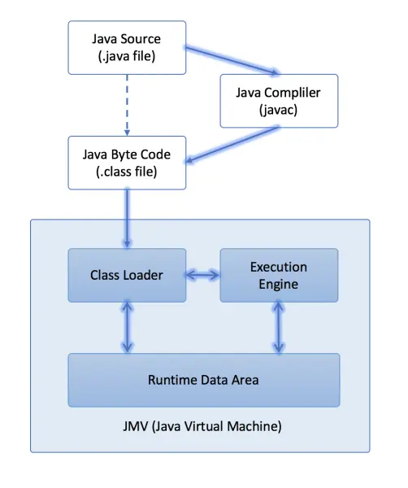

- Java源代码编译为字节码（_ByteCode_）：是由Java源码编译器（_Javac_）来完成
- Java字节码（_ByteCode_）的执行：由JVM执行引擎来完成
	- 类加载器(_Class Loader_)读取.class文件到JVM
	- 执行引擎(_Execution Engine_)把这些文件解析成机器码(_Binary Code_)
	- 存放到JVM的运行数据区(_Runtime Data Area_)后，执行程序

- 编译型语言（_C/C++_）要求使用**编译器一次性将所有源代码编译为一个可执行程序**。（一般不可以跨平台）
- 解释型语言（_Python_）是使用**解释器一边执行一边转换**，用到些源代码就转换哪些，不会生成可执行程序。（一般可以跨平台）
- 混合型语言（_Java_）
	- 编译为字节码文件
	- 在虚拟机上进行运行而不是在系统上运行