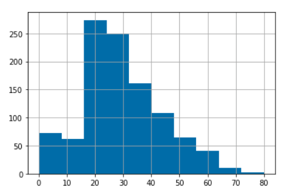

# Set up
```Python
import numpy as np
import pandas as pd
import urllib
# 重现性
np.random.seed(seed=1234)
```
# Download Data
首先，我们要获得一些数据。我们将从下面的公共链接中下载titanic数据集。
## Downloading
```Python
# 将数据从GitHub下载到笔记本电脑的本地磁盘
url = "https://raw.githubusercontent.com/GokuMohandas/Made-With-ML/main/datasets/titanic.csv"
response = urllib.request.urlopen(url)
html = response.read()
with open('titanic.csv', 'wb') as f:
    f.write(html)
```

## Check
```Python
!ls -l

"""
total 88
drwxr-xr-x 1 root root 4096 Mar 28 13:52 sample_data -rw-r--r-- 1 root root 85153 Mar 30 06:59 titanic.csv
"""
```

# Load Data
现在我们有一些数据可以使用，让我们加载到Pandas数据帧（dataframe）中。Pandas是一个很棒的python数据库分析库。
```Python
# 从CSV读取到Pandas DataFrame
df = pd.read_csv(url, header=0)
# 前3项
df.head(3)
```
他们有不同的特征:
-   P舱：旅行舱位
-   姓名：乘客的全名
-   性别：性别
-   年龄：数字年龄
-   兄弟姐妹：#兄弟姐妹/配偶
-   帕奇：船上的父母/儿童人数
-   票号：票号
-   票价：机票费用
-   小屋：房间位置
-   标记：乘客登船的港口（C - 瑟堡，S - 南安普敦，Q = 皇后镇）
-   幸存：生存指标（0 - 死亡，1 - 幸存）
# Exploratory data analysis (EDA)
```Python
import matplotlib.pyplot as plt
```
我们可以用`.describe()`来提取一些关于数值特征的标准细节
```Python
# 描述性统计
df.describe()
```
|        | pclass   | age       | sibsp    | parch    | fare      | survived |
|--------|----------|-----------|----------|----------|-----------|----------|
| count  | 1309     | 1046      | 1309     | 1309     | 1308      | 1309     |
| mean   | 2.294882 | 29.881135 | 0.498854 | 0.385027 | 33.295479 | 0.381971 |
| std    | 0.837836 | 14.4135   | 1.041658 | 0.86556  | 51.758668 | 0.486055 |
| min    | 1        | 0.1667    | 0        | 0        | 0         | 0        |
| 25%    | 2        | 21        | 0        | 0        | 7.8958    | 0        |
| 50%    | 3        | 28        | 0        | 0        | 14.4542   | 0        |
| 75%    | 3        | 39        | 1        | 0        | 31.275    | 1        |
| max    | 3        | 80        | 8        | 9        | 512.3292  | 1        |

## Correlation matrix
```Python
# 相关矩阵
plt.matshow(df.corr())
continuous_features = df.describe().columns
plt.xticks(range(len(continuous_features)), continuous_features, rotation="45")
plt.yticks(range(len(continuous_features)), continuous_features, rotation="45")
plt.colorbar()
plt.show()

```


## Histograms
我们还可以用`.hist()`来查看每个特征的值的直方图。
```Python
# age的直方图
df["age"].hist()
```

```Python
# 唯一值
df["embarked"].unique()

"""
array(['S', 'C', nan, 'Q'], dtype=object)
"""
```

## Filtering
我们可以根据特征，甚至根据特定特征中的特定值(或值范围)过滤数据。