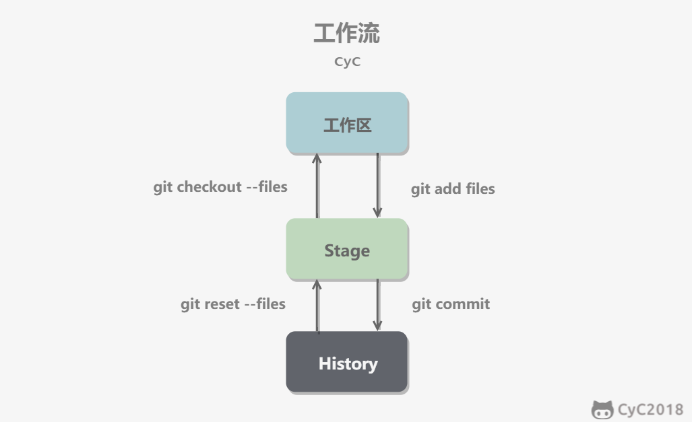

Git 是一个分布式版本控制系统。
## Git 配置
可以保存 Git 用户名和电子邮件，这样就不必在以后的 Git 命令中再次输入它们。

在命令行中配置本地仓库的账号和邮箱：
```
git config --global user.name "Nian"  
git config --global user.email "1275102714@qq.com"  
```
**工作原理 / 流程**：


## 工作区
新建一个仓库之后，当前目录就成为了工作区，工作区下有一个隐藏目录 .git，它属于 Git 的版本库。

```
git init
```

```
git clone xxx
```

## 版本库
Git 的版本库有一个称为 Stage 的暂存区以及最后的 History 版本库，History 存储所有分支信息，使用一个 HEAD 指针指向当前分支。


## 工作区与版本库
-   `git add files` 把文件的修改添加到暂存区，当添加所有的文件时：`git add .`
-   `git commit` 把暂存区的修改提交到当前分支，提交之后暂存区就被清空了，`git commit -m "wrote a readme file"`,-m 后面是你修改的指令说明，这样你就能从历史记录里方便地找到改动记录。
-   `git status`查看是否有文件未提交
-   `git reset -- files` 使用当前分支上的修改覆盖暂存区，用来撤销最后一次 git add files
-   `git checkout -- files` 使用暂存区的修改覆盖工作目录，用来撤销本地修改



可以跳过暂存区域直接从分支中取出修改，或者直接提交修改到分支中。

-   `git commit -a` 直接把所有文件的修改添加到暂存区然后执行提交
-   `git checkout HEAD -- files` 取出最后一次修改，可以用来进行回滚操作


## 添加远程仓库GitHub
### 设置SSH key
1. **获取SSH key**
在git Bash中输入
```
ssh-keygen -t rsa -C "1275102714@qq.com"
```
一路回车，使用默认值即可。在user主目录里找到.ssh目录，里面有**id_rsa和id_rsa.pub**两个文件。
- id_rsa是私钥，不能泄露出去。
- id_rsa.pub是公钥，公钥可以放心地告诉任何人。

2. **绑定ssh key**
GitHub->settings->SSH Keys->Title+Key(id_rsa.pub内容)

### 关联本地版本库和远程库
1. **关联**
将本地仓库和远程仓库进行关联，并将远程仓库命名为`origin` 
```
git remote add origin "https"
```
**不能同时连接多个远程仓库**，要修改：
```
git remote rm origin
git remote add ...
```

2. **推送**
为当前分支改名：`-m`改名，`- M`强制改名，git Bash中发现名字由master->main
```
git branch -M main
```
将本地仓库中的内容推送到远程仓库`origin`中。 
```
git push -u origin main
```
第一次提交使用`-u`，之后就`git push`就好（带上-u参数其实就相当于记录了push到远端分支的默认值）

## 分支

使用指针将每个提交连接成一条时间线，HEAD 指针指向当前分支指针。
- `git branch`查看分支


- `git branch branchname`新建分支
- `git checkout branchname`切换分支
- `git branch –d branchname`删除分支
新建分支是新建一个指针指向时间线的最后一个节点，并让 HEAD 指针指向新分支，表示新分支成为当前分支。


每次提交只会让当前分支指针向前移动，而其它分支指针不会移动。


合并分支也只需要改变指针即可。
- `git merge branchname`合并某分支到当前分支


当两个分支都对同一个文件的同一行进行了修改，在分支合并时就会产生冲突。


Git 会使用 <<<<<<< ，======= ，>>>>>>> 标记出不同分支的内容，只需要把不同分支中冲突部分修改成一样就能解决冲突。
```
<<<<<<< HEAD
Creating a new branch is quick & simple.
=======
Creating a new branch is quick AND simple.
>>>>>>> feature1
```

通常合并分支时，git一般使用”Fast forward”模式
"快进式合并"（fast-farward merge），会直接将 master 分支指向合并的分支，这种模式下进行分支合并会丢失分支信息，也就不能在分支历史上看出分支信息。

可以在合并时加上 --no-ff 参数来禁用 Fast forward 模式，并且加上 -m 参数让合并时产生一个新的 commit。
```
$ git merge --no-ff -m "merge with no-ff" dev
```


## 储藏（Stashing）
在一个分支上操作之后，如果还没有将修改提交到分支上，此时进行切换分支，那么另一个分支上也能看到新的修改。这是因为所有分支都共用一个工作区的缘故。

可以使用 git stash 将当前分支的修改储藏起来，此时当前工作区的所有修改都会被存到栈中，也就是说当前工作区是干净的，没有任何未提交的修改。此时就可以安全的切换到其它分支上了。
```
$ git stash
Saved working directory and index state \ "WIP on master: 049d078 added the index file"
HEAD is now at 049d078 added the index file (To restore them type "git stash apply")
```

该功能可以用于 bug 分支的实现。如果当前正在 dev 分支上进行开发，但是此时 master 上有个 bug 需要修复，但是 dev 分支上的开发还未完成，不想立即提交。在新建 bug 分支并切换到 bug 分支之前就需要使用 git stash 将 dev 分支的未提交修改储藏起来。

## 集中式与分布式
Git 属于分布式版本控制系统，而 SVN 属于集中式。


集中式版本控制只有中心服务器拥有一份代码，而分布式版本控制每个人的电脑上就有一份完整的代码。

集中式版本控制有安全性问题，当中心服务器挂了所有人都没办法工作了。

集中式版本控制需要连网才能工作，如果网速过慢，那么提交一个文件会慢的无法让人忍受。而分布式版本控制不需要连网就能工作。

分布式版本控制新建分支、合并分支操作速度非常快，而集中式版本控制新建一个分支相当于复制一份完整代码。

## GIT的版本回退
1. **提交版本**
```
git log
```
我们可以看到每次提交的时候都干了什么，以及每个版本的版本号

2. **回退版本**
HEAD来表示当前的版本，回退到上一个版本：
```
git reset --hard HEAD^
```

若是版本号很多，则
```
git reset  --hard HEAD~100
```

Git在内部有个指向当前版本的HEAD指针，当你回退版本的时候，Git仅仅是把HEAD从指向回滚到的版本。

3. **利用版本号回退**
```
git reset  --hard 版本号
```

获取版本号
```
git reflog
```

## .gitignore 文件
忽略以下文件：

-   操作系统自动生成的文件，比如缩略图；
-   编译生成的中间文件，比如 Java 编译产生的 .class 文件；
-   自己的敏感信息，比如存放口令的配置文件。

## Git 命令一览
