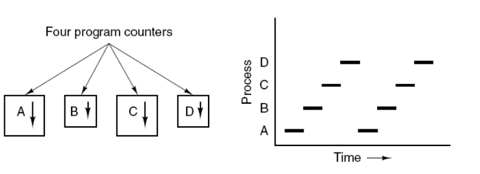
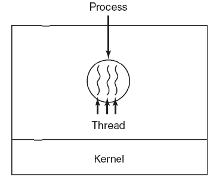
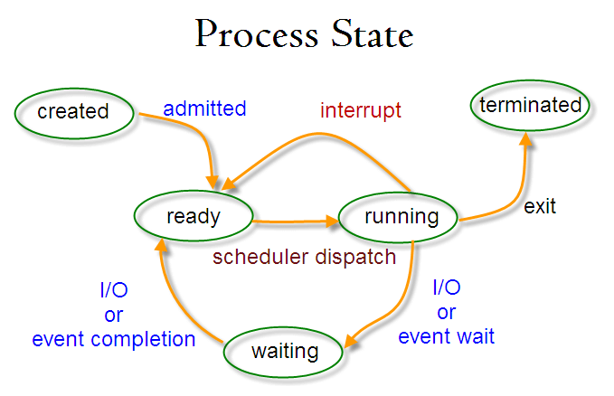

# 第一章：进程与线程

## 1.1 进程与线程产生的背景

最初的计算机只能接受一些特定的指令，用户每输入一个指令，计算机就做出一个操作。当用户在思考或者输入时，计算机就在等待。这样效率非常低下，在很多时候，计算机都处在等待状态。

### 1.1.1 批处理操作系统

后来有了**批处理操作体统**，把一系列需要操作的指令写下来，形成一个清单，一次性交给计算机。用户将多个需要执行的程序写在磁带上，然后交由计算机去读取并逐个执行这些程序，并将输出结果写在另一个磁带上。

批处理操作系统在一定程度上提高了计算机的效率，但是由于**批处理操作系统的指令运行方式仍然是串行的，内存中始终只有一个程序在运行**，后面的程序需要等待前面的程序执行完成后才能开始执行，而前面的程序有时会由于I/O操作、网络等原因阻塞，所以**批处理操作效率也不高**。

### 1.1.2 进程的提出

人们对于计算机的性能要求越来越高，现有的批处理操作系统并不能满足人们的需求，而批处理操作系统的瓶颈在于内存中只存在一个程序，那么**内存中能不能存在多个程序**呢？这是人们亟待解决的问题。

于是，科学家们提出了进程的概念。

进程就是**应用程序在内存中分配的空间，也就是正在运行的程序**，各个进程之间互不干扰。同时进程保存着程序每一个时刻运行的状态。

> 程序：用某种编程语言(java、python等)编写，能够完成一定任务或者功能的代码集合,是指令和数据的有序集合，是**一段静态代码**。

此时，CPU采用时间片轮转的方式运行进程：CPU为每个进程分配一个时间段，称作它的时间片。如果在时间片结束时进程还在运行，则暂停这个进程的运行，并且CPU分配给另一个进程（这个过程叫做上下文切换）。如果进程在时间片结束前阻塞或结束，则CPU立即进行切换，不用等待时间片用完。

> 当进程暂停时，它会保存当前进程的状态（进程标识，进程使用的资源等），在下一次切换回来时根据之前保存的状态进行恢复，接着继续执行。

使用进程+CPU时间片轮转方式的操作系统，在宏观上看起来同一时间段执行多个任务，换句话说，**进程让操作体统的并发成为了可能**。虽然并发从宏观上看有多个任务在执行，但在事实上，对于**单核CPU**来说，任意具体时刻都只有一个任务在占用CPU资源。

虽然进程的出现，使得操作系统的性能大大提升，但是随着时间的推移，人们并不满足一个进程在一段时间只能做一件事情，**如果一个进程有多个子任务时，只能逐个得执行这些子任务**，很影响效率。

>比如杀毒软件在检测用户电脑时，如果在某一项检测中卡住了，那么后面的检测项也会受到影响。或者说当你使用杀毒软件中的扫描病毒功能时，在扫描病毒结束之前，无法使用杀毒软件中清理垃圾的功能，这显然无法满足人们的要求。

### 1.1.3 线程的提出

那么能不能让这些子任务同时执行呢？于是人们又提出了线程的概念，**让一个线程执行一个子任务，这样一个进程就包含了多个线程，每个线程负责一个单独的子任务。**

多进程的方式也可以实现并发，为什么我们要使用多线程？

-  进程间的通信比较复杂，而线程间的通信比较简单，通常情况下，我们需要使用共享资源，这些资源在线程间的通信比较容易。
-  进程是重量级的，而线程是轻量级的，故多线程方式的系统开销更小。

## 1.2 进程与线程的区别

### 1.2.1 进程

进程是资源分配的基本单位。

进程控制块 (Process Control Block, PCB) 描述进程的基本信息和运行状态，所谓的创建进程和撤销进程，都是指对 PCB 的操作。

下图显示了 4 个程序创建了 4 个进程，这 4 个进程可以并发地执行。

### 1.2.2 线程

线程是独立调度的基本单位。

一个进程中可以有多个线程，它们共享进程资源。

QQ 和浏览器是两个进程，浏览器进程里面有很多线程，例如 HTTP 请求线程、事件响应线程、渲染线程等等，线程的并发执行使得在浏览器中点击一个新链接从而发起 HTTP 请求时，浏览器还可以响应用户的其它事件。

### 1.2.3 区别

Ⅰ 拥有资源

进程是资源分配的基本单位，但是线程不拥有资源，线程可以访问隶属进程的资源。

Ⅱ 调度

线程是独立调度的基本单位，在同一进程中，线程的切换不会引起进程切换，从一个进程中的线程切换到另一个进程中的线程时，会引起进程切换。

Ⅲ 系统开销

由于创建或撤销进程时，系统都要为之分配或回收资源，如内存空间、I/O 设备等，所付出的开销远大于创建或撤销线程时的开销。类似地，在进行进程切换时，涉及当前执行进程 CPU 环境的保存及新调度进程 CPU 环境的设置，而线程切换时只需保存和设置少量寄存器内容，开销很小。

Ⅳ 通信方面

线程间可以通过直接读写同一进程中的数据进行通信，但是进程通信需要借助 IPC。

## 1.3 进程切换

### 1.3.1 进程状态切换

在现在的操作系统中，线程是被视为轻量级进程的，所以**操作系统线程的状态其实和操作系统进程的状态是一致的**。

- 就绪状态（ready）：等待被调度
- 运行状态（running）
- 阻塞状态（waiting）：等待资源

应该注意以下内容：

- 只有就绪态和运行态可以相互转换，其它的都是单向转换。就绪状态的进程通过调度算法从而获得 CPU 时间，转为运行状态；而运行状态的进程，在分配给它的 CPU 时间片用完之后就会转为就绪状态，等待下一次调度。
- 阻塞状态是缺少需要的资源从而由运行状态转换而来，但是该资源不包括 CPU 时间，缺少 CPU 时间会从运行态转换为就绪态。

### 1.3.2 上下文切换

上下文切换（有时也称做进程切换或任务切换）是指 CPU 从一个进程（或线程）切换到另一个进程（或线程）。上下文是指**某一时间点 CPU 寄存器和程序计数器的内容**。上下文切换只能发生在内核态中。

>寄存器是cpu内部的少量的速度很快的闪存，通常存储和访问计算过程的中间值提高计算机程序的运行速度。
>
>程序计数器是一个专用的寄存器，用于表明指令序列中 CPU 正在执行的位置，存的值为**正在执行的指令的位置或者下一个将要被执行的指令的位置**，具体实现依赖于特定的系统。

举例说明 线程A - B

- 先挂起线程A，将其在**CPU中的状态保存在内存中**。
- 在内存中检索下一个线程B的上下文并将其在 **CPU 的寄存器中恢复**，执行B线程。
- 当B执行完，根据**程序计数器中指向的位置**（即跳转到线程A被中断时的代码行）恢复线程A。

CPU通过为每个线程分配**CPU时间片**来实现多线程机制。CPU通过时间片分配算法来循环执行任务，当前任务执行一个时间片后会切换到下一个任务。

但是，在切换前会保存上一个任务的状态，以便下次切换回这个任务时，可以再加载这个任务的状态。所以任务从保存到再加载的过程就是一次上下文切换。

上下文切换通常是计算密集型的，意味着此操作会**消耗大量的 CPU 时间，故线程也不是越多越好**。如何减少系统中上下文切换次数，是提升多线程性能的一个重点课题。

## 1.4 线程调度

- 分时调度：所有线程轮流使用 CPU 的使用权，平均分配每个线程占用 CPU 的时间。
- 抢占式调度：优先让优先级高的线程使用 CPU，如果线程的优先级相同，那么会随机选择一个(线程随机性)。

>注意：Java 使用的是抢占式调度。